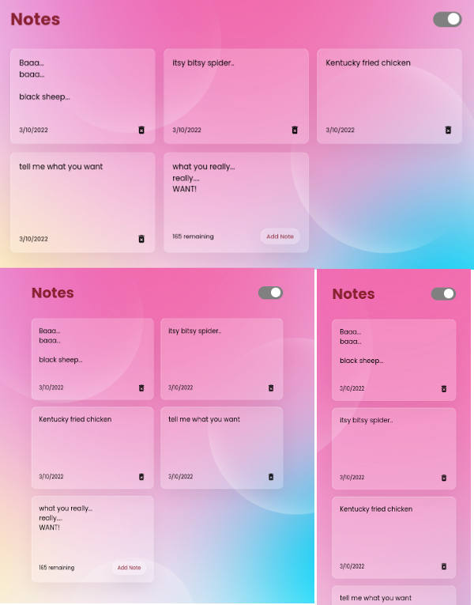

## DESCRIPTION:
- React Notes App, made with React.
- Features: 
    - Glassmorph style UI.
    - light/dark mode.
    - save & retrieve notes from local storage.
- [Youtube Video of the App](https://youtu.be/FA7mEjiwgvs)

## OUTCOME:
- Practise makes purrrfect! 
- link to the UI's video on youtube: https://youtu.be/FA7mEjiwgvs

## TECH STACKS:
- React
- Icons: React-icons,
- Hooks: useState, useEffects
- styling: CSS with B.E.M naming convention

## PROGRESS:
- 100%;
- Mobile Responsive? YES.

## TODO:
- I want to also save the light/dark theme to the local storage. But I don't know how to do it (yet). Right now, only the notes are saved to the local storage.

## How to run
`yarn install`
`yarn start`

## View other projects:
- [My Blog](https://hashnode.com/@marizoo)
- [My Pinterest](https://pin.it/16vGwjy)
- [My Youtube Channel](https://www.youtube.com/channel/UCfkbnM9WvHD3mjecBiGHCBQ/playlists)

## IMAGE:

